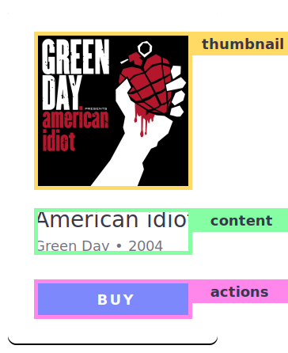

# First composition

Let's create our first composition. With Atomic Layout a layout composition is physical and you can render it as a React component called `<Composition/>`. Any layout piece is a combination of its counterparts, whether it's an entire page or a small button. You can apply this principle throughout the entire application and remain consistent in the way your components are declared.

**Consider the following UI element as our goal:**


Following the best practices, we are going to start from mobile design and gradually move upward bigger screens.

## New component

To start, let's create a new `Album` component that will represent our UI element.


```jsx
import React from 'react'

const Album = () => (
  <p>Nothing unusual yet</p>
)

export default Album
```


## Composition

Next step, let's import the `Composition` components from the `atomic-layout` package at the top of your `Album` file:

```jsx
import React from 'react'
import { Composition } from 'atomic-layout'
```

When describing a layout composition we can split our UI element in to pieces, or _areas_. Looking at our design, we could have the following areas:



> Although there are no strict rules regarding areas breakdown, try for area names to be meaningful in their domain. For example, favor area names like "thumbnail" or "content" over "top" or "bottom". This is especially useful when dealing with responsive layouts, as the position of an area may change. Having "top" area on the bottom right is rather ridiculous.

> ### Composition areas are verbal representation of layout areas, sensitive to their position in space and relation to each other.

Once we are happy with the areas names, we need to write them down. We are going to create a variable `areasMobile` that will hold a description of our areas on mobile screens.

```jsx
// Template string literal helps to preserve the vertical relation
// of areas. Below, we've described three areas one by one,
// just as they appear on the design.
const areasMobile = `
  thumbnail
  content
  actions
`
```

On its own the `areasMobile` variable is just a string. In order for it to be used as a blueprint for a layout composition, we need to pass it as a value to the `areas` prop of the `Composition` component:

```jsx
const Album = () => (
  <Composition areas={areasMobile}>
    <p>Still nothing extraordinary</p>
  </Composition>
)
```

If a Composition component accepts areas it returns React components generated based on passed areas. Those components are available in the children render function as arguments:

```jsx
const Album = () => (
  <Composition areas={areasMobile}>
    /* React components based on "areasMobile" areas */
    {(Areas) => (
      <> // <- notice the React.Fragment wrapper
        <Areas.Thumbnail>Our thumbnail</Areas.Thumbnail>
        <Areas.Content>Content</Areas.Content>
        <Areas.Actions>Call to action</Areas.Actions>
      </>
    )}
  </Composition>
)
```

> Pay attention that all children \(area components\) are wrapped in `React.Fragment` \(`<></>`\). This is necessary because CSS Grid currently affects only direct children, so must make sure area components are direct children of the `Composition`.

Now we can render other components inside those area component to make up the desired appearance. This is an example of how this would look like:

```jsx
const Album = ({ title, imageUrl, releaseYear, artistName }) => (
  <Composition areas={areasMobile}>
    {(Areas) => (
      <>
        <Areas.Thumbnail>
          
        </Areas.Thumbnail>
        <Areas.Content>
          <h3>{title}</h3>
          <p>{artistName} • {releaseYear}</p>
        </Areas.Content>
        <Areas.Actions>
          <button>Buy</button>
        </Areas.Actions>
      </>
    )}
  </Composition>
)
```


Styling visual appearance of children UI elements, such as image or button, is not a part of this tutorial, because it's not the responsibility of Atomic Layout. Please refer to the complete example \(live sandbox\) at the bottom of this page for styling references.


## Areas relation

Our areas template string describes a spacial relation of areas. However, to specify things like an area's dimensions, or spacing between the areas, we may use additional CSS properties.

For example, to space out the areas we can use the `gap` prop \(that aliases `grid-gap` CSS property\).

```jsx
const Album = () => (
  <Composition areas={areasMobile} gap={10}>
    {(Areas) => (
      /* Same areas here... */
    )}
  </Composition>
)
```

> Prop `gap={10}` applies `grid-gap: 10px;` in the generated styles.


Read about [**CSS Grid**](https://developer.mozilla.org/en-US/docs/Web/CSS/grid) to know how to describe created compositions \(CSS Grid containers\). You are going to use this knowledge a lot when working with the library.


## Summary

In this section we have learned:

* How to break down UI element to composition areas;
* How to use Composition component;
* How to control relation between composition areas;

### Live example



