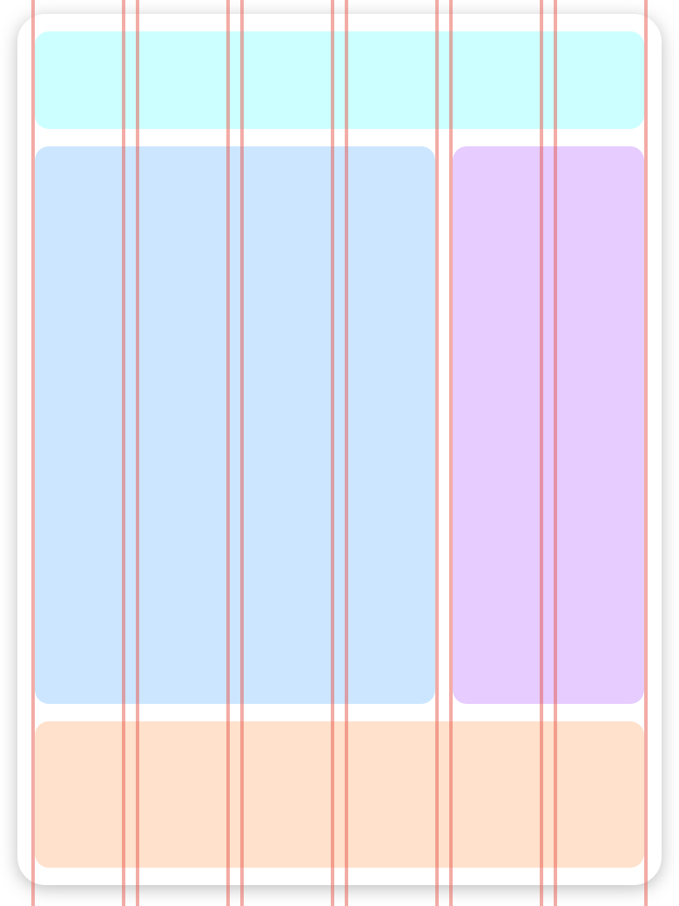

# Motivation

In the era of erupting component-focused development, we often underestimate spacing as a powerful relation distributing tool. Rigid frameworks have taken place of what might have been a simple, implementation vision of spacing, and layout composition that it empowers.

Inspired by [Atomic design](http://bradfrost.com/blog/post/atomic-web-design), Atomic Layout comes in to bring developers a physical grasp over such previously empirical concepts as spacing and composition. Apart from challenging the interface development process, it also focuses on making it fast and standardized, resulting into **layout that is easy to understand and maintain**.

## Core principles

### Semantics

Atomic Layout values semantics. That's why it favors terms like "Composition" instead of "Grid", "Row", or "Column", unlike most of the other solutions.

Semantically, grid is a composition of rows and columns. In fact, any UI element is a composition of its sub-elements, making composition a far more superior and non-restricting concept than explicit grid/row/column.

Encouraging declarative layouts, Atomic Layout leverages the concept of composition over grid or flexbox, which are rather implementation details over how the layout is achieved. With Composition you express an intent and semantical combination of layout elements, not coupling them with how they are being implemented. Think of it as a `React.Component` for layout definition: it's a common pattern to declare any layout piece.

### Physical composition

In Atomic Layout Composition is a physical component you can render. It acts as a CSS Grid wrapper internally, but conceptually provides a dedicated layer to control the composition of its children.

```jsx
import { Composition } from 'atomic-layout'

<Composition areas="icon text">
  {/* Areas components generated from the "areas" prop */}
  {({ Icon, Text }) => (
    <>
      <Icon>...</Icon>
      <Text>...</Text>
    </>
  )}
</Composition>
```

### Nested composition

Any interface element can be a combination of other elements. Since we wield a composition as a physical component, we can have elements composition by nesting their respective components.

```jsx
import { Composition } from 'atomic-layout'

{/* Defining "Button" as a composition */}
const Button = () => (
  <Composition areas="icon text">{...}</Composition>
)

export const CardItem = () => (
  <Composition areas="actions">
    {({ Actions }) => (
      <>
        <Actions>
          {/* Rendering "Button" as a composite */}
          <Button>Purchase</Button>
        </Actions>
      </>
    )}
  </Composition>
)
```

### Responsive

Having responsive design has become a must in the modern web development. In fact, it is such an essential part of a layout composition that it makes no sense to decouple them. Although its usage is not obligatory, Atomic Layout comes with responsive behavior built-in. That negates the need for additional CSS to define conditional layout areas, or responsive CSS properties.



## Comparison

Ideas encouraged by Atomic Layout may be hard to understand at first. However, by comparing it to one of the most popular frameworks for building user interfaces you can immediately get the high-level overview of what Atomic Layout is about.

### Bootstrap

In Bootstrap you have a grid system that sits on top of your page and serves as a ruler to snap the elements to. Once the amount of grid columns is specified, you start placing some components relatively to those columns.



That kind of grid cannot be applied to each individual component you render, thus forcing you to write additional CSS to implement what appears but a regular composition. This is a primary problem Atomic layout aims to resolve.

### Atomic Layout

In Atomic Layout **anything** **can be a composition and a composite at the same time**. A grid is a composition of rows and columns, and a header is a composition of logo, menu and actions.


> ### **It is like a grid that goes all the way down, to the furthest leaves of an interface tree.**

